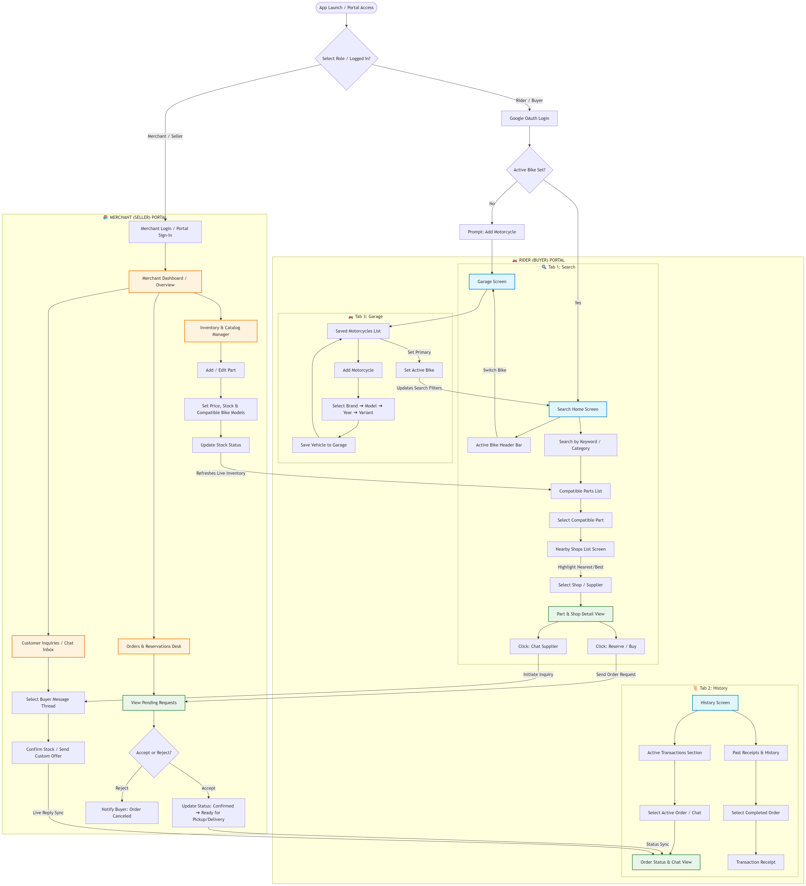

# PiesaHub — Dual-Portal User Flow Diagrams

This document outlines the visual user flow diagrams and screen navigation maps for both sides of the **PiesaHub** ecosystem: the **Rider (Buyer) Portal** and the **Merchant (Seller) Portal**.

---

## 📊 Dual-Portal User Flow Diagram (Mermaid)

The flowchart below maps the entire user journey—from initial app authentication to part discovery, inventory management, buyer-seller messaging, and order fulfillment.

---

## 📝 Navigation Hierarchy

### 🏍️ Rider Application (3-Tab Architecture)

* **1. Search Tab (Primary Landing)**
  * Active Bike Header Bar *(Toggle/Change active bike context)*
  * Keyword / Category Search
  * Search Results *(Compatible Parts List)*
    * Part & Supplier Details Screen
      * Direct In-App Supplier Chat
      * Reserve / Buy *(Pickup or Delivery)*
* **2. History Tab**
  * Active Transactions *(Live Order Status & Active Chat Threads)*
  * Past Transactions *(Receipts, History, Completed Orders)*
* **3. Garage Tab**
  * Saved Vehicles List *(Set Active Primary Bike)*
  * Add Motorcycle Form *(Brand ➔ Model ➔ Year ➔ Variant)*

---

### 🏪 Merchant Portal (Seller Operations)

* **1. Dashboard & Catalog Operations**
  * Live Inventory List & Stock Management
  * Add/Edit Parts with Fitment Rules *(Link to bike models & specs)*
* **2. Order & Reservation Desk**
  * Pending Requests Queue *(Accept / Reject actions)*
  * Order Lifecycle Management (`Confirmed` ➔ `Ready for Pickup/Delivery` ➔ `Completed`)
* **3. Chat Inbox**
  * Real-Time Messaging Thread with Buyers
  * Direct Stock Availability Confirmation

---

*PiesaHub Documentation — Sourcing the right motorcycle part, every time.*