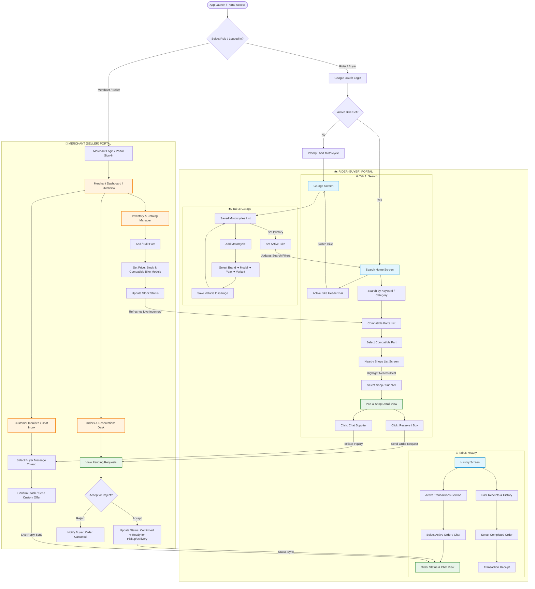

![Mermaid Editor](https://mermaid.live/edit#pako:eNq1V9lu20YU_ZUBixgJINtavMgM2kKLF6GyZVBKCpcyjDE5FFlTJEMO7aiWX_sW5KF5LNr3fkG_Jz_QfkLvLCSHWmwXTQ3YnhnOPXPnLufeudes0Caarjl-eGe5OKZo1B3H4wDBz4sXqBVFqI_TwHLRBjoPY4p9NLzzqOVmm4YUhF6aysbtbGPLskiSXL5Cm5vfICP0Sccl1s39kPjEonwB9vbDyYTYqBd8-5BBZv9zEQBAhmeTGPa30xn854hspZVS1zwOwwmADdiEAXrB5UqMUxLDHQMKMKCEL3GyVQ6Vb-EwxV2G3iTY7AlcxT5f_-sfRbi2hYxe99BAL9tvLg6NV-h8YIxafXTUH3z_Rc7ILaTYy6LeLWl7N9IZYo7YAtiEFk5YtZvZ8CzkYC3bZsvncTiNqCn-6WwVnYY0jK2Z5ZPcCaXNQperYxzjCRnh66cOvCCJFBkSDM6RIplYkl5PYhy5wpRX0oTmWPv7948f_vrz40oTj7VcNzXgpMFHrTaq6Wh42DI6J-q34qwr2FMTp3z6gEAlLsD1W8DmVytUN8UInYRTMLgVExJcCoPmNz8hGCxhqp4RS6iN4yXsRTkGNhcpymXnq2y96uILinKlxAyOzdS-nqHvyOwujG1IjQ6mZBLGsyWdcjEFxCBJ6tPE7EAMYOpdQ76eA3MkqO8l9PIpxUoYEpWxCIMwJaEsIK_QKpMQAG4YnXgT14df0OsMToDbsVWhU-adJ1Ur4XDz51PEUElCt9vwZ863dnBsZxqzOeOiNIp8jyz7NtvP9WWKdwnFnv_WI3cmv8eGgBDLiK0_qW4ZhiN3XEzbNDA7vmfd6Hy6XqcV8uAWEkMMFhByRdB1CYIEtpq9SsbVdXTSG44GxsX6lKuLlPvlV55yTAIcBRG4MufkN5Z0crgi4QYx5EySJdsoxkGCYRwGCcQLHzyKLD2TUInDhnB7i3gRxMJGpt-TXlGVWdSuR8k0ixipJ19nGQiuunwEi4lK8uRzJX4EBFRvmjJFudOfGUDZbcuXV9VkqegTCnWdf7pci1EoKGzGVVO8kK0_M4YaOjpuGa3jw_Uh1FBrA_Mgk-H8uDKIcuo0xagUQoxfGVWYQ3xL1Mr3TFbL5AVnE4rOY2-K49mcleKC2E32SSkHl4_hZMWWZeOacrw2CHPJ_HZHYZw7tQ1usdHn3z4Bpk18ProAfuODtzj2oG1aqRoDEZSLswvBAL0lrgdqIRpKByzzn9xfMvaKSFgRFP-1N6tvodNDKP-tsxF6OTzs9_-P_iyPzOyocvvyx1oVFkJV7WBFS3vVxYl7HbJak3e0-RIQx-AW-DnL9oVE6gW3JOB0eYoDcMsUZqXTCnB5WC5hFrIbrD3AfjiRKGUSUGSyoOWlnEXsNjq0Pbpcw-Uevv_Io0ytUxxFXjAxZe5YpAKMFkLfuKF2AzyEeMwmJcAySB6hXJE3kQ3djUQTLLnKVoJFj1Lf8Xz_aUPJKiHpc0PWSSzqTZckNwtGUni2F1jhFNSUELz4nkPQM80N8i6FBqN8u7KALCoWiahBfoR0vhcTFMZILBSt_yI3qGKsI5eSDFGYSdinsBmbQR8RBo4XT4ngDAO60xly4LhzaBHSaLtLfCC0hdq4eFQ-gi4FBxbx-W3Ms5B6zky8BXXpBPGd2KvcJB6Np_AaxfCqmzzuJFYKzU4KhXsKQr3gXerFHlC6KLewcB2-X_AT_5C1UiM3hrvmrKkcDQ0G_1aSLkRkIYz8GRcypQFlELI3K_CvUAwNHEdJqS9Mfh1jMBxuSi7qnY0OjVZn1BucDeUzCn3--VPOTa--yKmyB-WVsBd41GORJGwP5bCwUf5azHtOWTwD2WtkyTBfSIBMUI1YISqGw1lgzZf7pOK8zC1cqM9qMV97SjBjFC5mEAeeAy7vD25JwbTz8gMnl1W7AA4gtE_kdmAwn8Ld5usex-CSIZ35SshbPk6SLnFQzJ7b7CNBjLv0r0jN2XVIJaFxeEP0r6r1ZtOuyenmnWdTV69H718vAU1lfVGxHMdpkGqO5ezuW9XqM7Cc0EqTklJNZ5cc5ECNZpM0rPVAJUDVKBW1aa8obZ1ih7I6KjFUlHJVyVi5ItO-dP8FjPJjqbIUJJUFki7u_1qraBPQTdNpnJKKBqdMMZtq9-yAsUZdKMxjTYehTRwMYTPWxsEDiEU4-CEMp5lkHKYTV9Md7CcwS3kAdT0MjUexBbKHxJ0wDaim1_d3OIam32vvNb12UN2qVXf29-DP7l6tubtf0Waavlmvbu01DnYO6gd7O7Vqo9nYeahoP_Fzq1vN3YPmXrPRqB7Ud_Z3GvWHfwBmaGqF)

